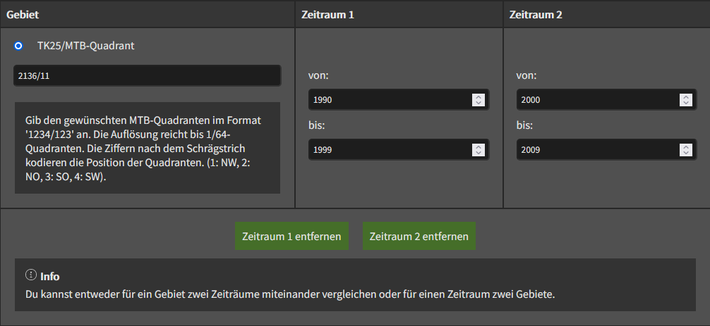

# Abfragekriterien

Zu Beginn der Anwendung können User\*innen eine Abfrage definieren. Die Kriterien für eine Abfrage sind das zu untersuchende Gebiet und der zu untersuchende Zeitraum. Die Quelle für die Erfassungsdaten ist die Floristische Datenbank Mecklenburg-Vorpommern (Flora-MV) mittels der WerBeo-API.

_Beispiel einer Abfrage in Floralink Web_

## Gebiet

Das Gebiet kann in Form eines Blattschnitts der amtlichen Topografischen Karten Deutschlands im Maßstab 1:25.000 (TK25) angegeben werden. Die Auflösung reicht von einem TK25-Blattschnitt bis zu 1/64-Quadranten dessen. Die Ziffern nach dem Schrägstrich kodieren die Position der Quadranten. (1: NW, 2: NO, 3: SW, 4: SO). Bei der höchsten Auflösung (1/64 TK25) entspricht die Untersuchungsfläche - je nach Lage in Deutschland - einer durchschnittlichen Fläche von etwa 2,1 km².

## Zeitraum

Für die Eingrenzung des Zeitraums werden zwei Jahreszahlen angegeben (von einschließlich, bis einschließlich). Es wird ein Fehler angezeigt, wenn die Daten vertauscht sind ("von" liegt nach "bis") oder der Zeitraum zu groß gewählt ist (> 30 Jahre).

## Vergleich

Du hast die Möglichkeit, ein weiteres Gebiet oder einen weiteren Zeitraum zum Vergleich anzugeben. Für die Kombination der Kriterien wird jeweils ein eigener Bericht angefertigt. Ist alles wie gewünscht eingestellt, klickst du auf "Abfrage durchführen" und der Bericht wird geladen.
